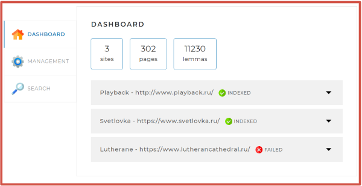
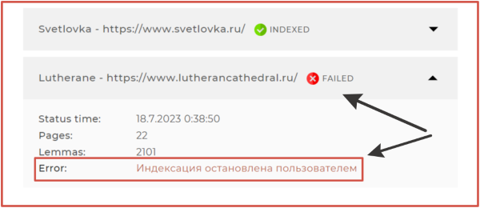
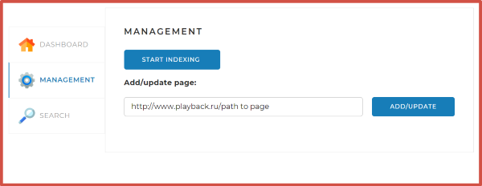
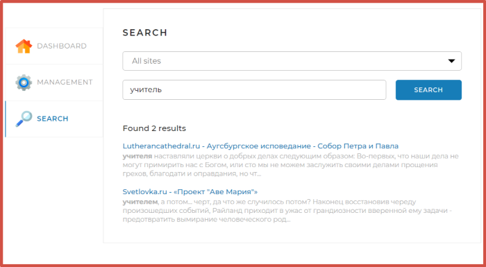
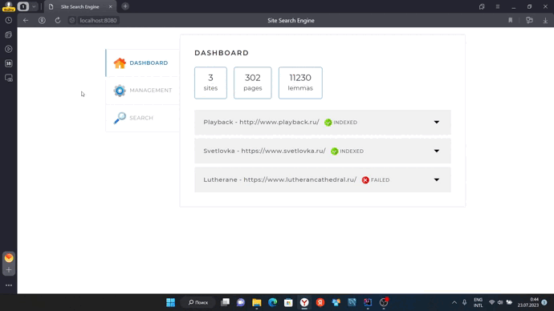
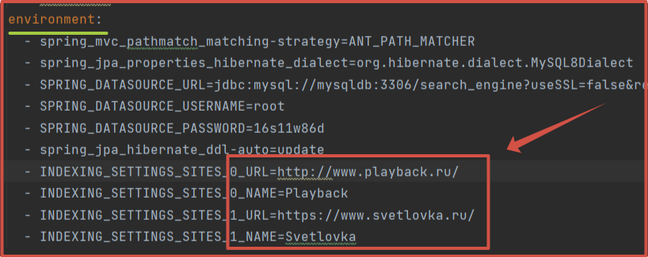

<h1 align="center">
  Поисковый движок (Search Engine)
</h1>
<h2 align="center">
  
</h2>

<h2 align="center">Описание проекта</h2>

- _Данное приложение позволяет <b>индексировать</b> страницы сайтов и осуществлять по ним быстрый поиск слов и фраз,
  вводимых пользователем в запросе._
- _Программа <b>обходит</b> все страницы сайта (сайтов), указанного в конфигурационном файле в многопоточном режиме, <b>
  сохраняет</b> их содержимое в таблицы в базе данных._
- _В проекте реализована <b>система индексации</b> (процесс формирования <b>поискового индекса</b> по некоторому объёму
  информации) страниц сайта, которая позволит подсчитывать встречающиеся на страницах сайта слова (точнее, их леммы) и
  по поисковому запросу определяет наиболее релевантные страницы._

> <b>Поисковый индекс</b> — это специальным образом организованная база данных (в нашем случае — база данных MySQL),
> позволяющая быстро и удобно осуществлять поиск по этой информациию

- _Реализована система поиска информации с использованием созданного <b>поискового индекса</b>. Метод поиска учитывает,
  по каким сайтам происходит этот поиск — по всем или по тому, который выбран в веб-интерфейсе в выпадающем списке._

  <h2 align="center">Демо</h2>

- вкладка <b>Dashboard</b> с отображением общей статистики по всем сайтам. Отображает общее количество индексируемых
  сайтов (3 <b>sites</b>), страниц (302 <b>pages</b>) на всех сайтах а также количество найденных лемм (11230 <b>
  lemmas</b>).

  <h2 align="center">
    
  </h2>

- вкладка <b>Dashboard</b> также содержит статистику по каждому сайту (количество страниц, лемм) с указанием статуса
  индексации: <b>"INDEXED"</b> - сайт успешно проиндексирован, <b>"INDEXING"</b> - в процессе индексации, <b>"
  FAILED"</b> - индексацию завершить не удалось. В последнем случае в блоке <b>"Error"</b> выводится соответствующее
  сообщение об ошибке, если пользователь останавливает процесс индексации, нажатием кнопки <b>"STOP INDEXING"</b>.

  <h2 align="center">
    
  </h2>

- вкладка <b>Management</b>. Здесь мы можем начать процесс индексации сайтов, указанных в конфигурационном файле, нажав
  кнопку <b>"START INDEXING"</b>, которая автоматически меняется на кнопку <b>"STOP INDEXING"</b> - соответственно
  останавливает индексацию. Кнопка <b>"ADD/UPDATE"</b> добаляет/обновляет данные в базе по отдельной странице, введенной
  в поле запроса (указывается полный путь к странице, начиная с главной).

  <h2 align="center">
    
  </h2>

- вкладка <b>Search</b>. Осуществляем поиск по сайтам (<b>All Sites</b>), указанными в конфигурационном файле. При этом
  можно выбрать из всплывающего списка конкретный сайт, где мы хотим найти нужную информацию. Данные отображаются в виде
  общего количества найденных результатов (<b>Found 2 results</b>) и списка самих страниц со сниппетами (фрагментами
  текста, в которых найдены совпадения).

  <h2 align="center">
    
  </h2>

- Демонстрация работы приложения.
  ⏬

   <h2 align="center">
    
  </h2>

<h2 align="center">Технологии в проекте</h2>

-  Поисковый движок разработан на фреймворке <b>Spring Boot</b>
-  Сборщик <b>Maven</b> с подключением шаблонизатора <b>Thymeleaf</b>
-  Реляционная база данных <b>MySQL</b>
-  Архитектура <b>REST</b>

<h2 align="center">Техническое описание проекта</h2>

### Установка и настройка

<b>Важно:</b> Перед запуском приложения убедитесь, что на вашем компьютере уже предустановлены

- Docker
- сборщик Maven
- БД MySQL

<b>Для запуска приложения необходимо:</b>

1. Скопировать проект с удаленного репозитория GitHub к себе на локальный компьютер.
2. Перейти в терминале командной строки в корневую папку проекта.
3. Выполнить команды:
    - <b><i>mvn clean package</i></b> (собираем проект в исполняемый jar-файл)

    - <b><i>docker-compose up -d</i></b> (запускаем контейнеры приложения и БД)

4. После успешной установки открываем браузер и переходим по указанному адресу: <b>http://localhost:8080/</b>

Вы можете указать новые URL (<b>url</b>) и имена (<b>name</b>) индексируемых сайтов. Эти параметры будут отображены на
вкладке <b>Dashboard</b> при запуске приложения.
Для этого необходимо в корневом каталоге проекта найти файл с конфигурациями <b>docker-compose.yml</b> и открыть его в
любом текстовом редакторе. Далее заменить адреса и названия на свои. В приложении представлены два сайта: <b>
Playback</b> и <b>Svetlovka</b>,
под индексами 0 и 1 соотвтсвенно.
<h2 align="center">

</h2>

<h2 align="center">Поздравляю, вы запустили приложение ... 🙂 </h2>

### Как помочь проекту

- для улучшения проекта необходимо подключить LuceneMorphology для английского языка (дописать код получения лемм из
  слов), чтобы поиск также осуществлялся на английском
